# Probar métodos de APIS (TESTING API)


### 1.  CREANDO PROYECTO
Primero creamos el proyecto, antes que todo, debemos ver que la 
versión de PHP sea mayor o igual a 7.3, para evitar conflictos, si queremos actualziar uno de los métodos es reinstalar xampp o el que uses.

```
ver la versión de php
-> php -v
```


Luego procedemos a crear el proyecto en laravel, lo hacemos a través del instalador de laravel *(debemos tener composer instalado)


```
Instalando instalador de laravel
-> composer global require laravel/installer
```


Después de esa instalación creamos el proyecto


```
Creando proyecto laravel
-> laravel new NOMBRE_DEL_PROYECTO
```


Dejamos que se cree el proyecto y una vez hay terminado nos saldrá lo siguiente *(Lo importante es mensaje final para ver si se creó correctamente).


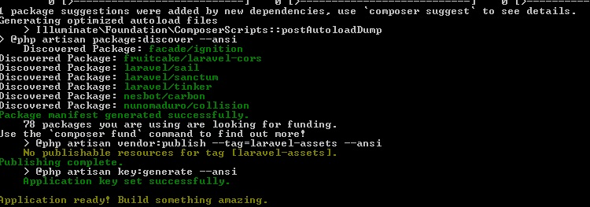


Una vez el proyecto se haya creado de forma correcta accedemos a la carpeta donde se creó.


```
accediendo a la carpeta y abriendo con el editor *(sólo VC)
-> cd NOMNRE_DEL_PROYECTO_CREADO
--------------------------------------------------------------------
una vez dentro de la carpeta del proyecto ponemos lo siguiente y nos abre en code
-> code .
```


### 2.  BASE DE DATOS


Ahora, debemos tener al menos XAMPP para nuestra base de datos, si tenemos configurado para abrir la consola de MySql, entonces ponemos lo siguiente.


```
accediendo a la consola de MySql
-> mysql -u root -p
```


Si no tenemos para abrir MySql entonces buscamos en la siguiente ruta *(Depende donde esté instalado xampp, si lo tienes en el disco ' C ' hazlo igual)


```
ruta para ejecutar MySql de xampp
-> c:\> cd xampp/mysql/bin
-------------------------------------------
ya estando dentro de bin ponemos lo siguiente y damos enter
-> mysql.exe -u root -p
```


Nos mostrará la consola de MySql


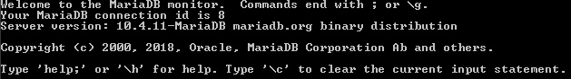


Y creamos nuestra base de datos


```
creando base de datos y accediendo 
-> create database NOMBRE_DE_LA_BASE_DATOS;
-----------------------------------------------
-> use NOMBRE_DE_LA_BASE_DATOS_CREADA;
accediendo
```


### 3.  CONFIGURANDO FICHERO .ENV


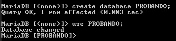


Ahora, ya que tenemos la base de datos, vamos a configurar el fichero .env de laravel, donde vamos a poner nuestras credenciales para la base de datos.


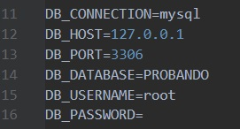


Reemplazamos el usuario y ponemos una contraseña si es que usamos, de lo contrario solo ponemos el nombre de la base de datos que creamos anteriormente en :package: DB_DATABASE = NOMBRE DE LA BASE DE DATOS CREADA. Ahora procedemos a crear los modelos que serían las tablas en la base de datos, usamos en siguiente comando.


### 4.  MODELOS & MIGRATION


```
# opción 1
comando para crear el modelo simplemente

-> php artisan make:model NOMBRE_MODELO -m

* el -m indica migrate
---------------------------------------------------------
# opción 2
comando para crear el modelo y el controlador

-> php artisan make:model NOMBRE_MODELO -mcr

* indica migrate y controller (recomendado)
---------------------------------------------------------
el controlador es donde estarán todas las funciones de CRUD
para hacer controller ponemos. (si usamos la primera opción en los modelos)

-> php artisan make:controller NOMBRE_CONTROLLER (Ejemplo UsuariosController) --resource

* para que se generen las funciones
```


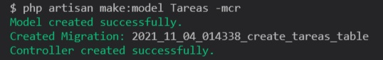


Ya que tenemos el modelo y el controlador, vamos a poner los campos de la tabla que tenemos en la base de datos, mediante el modelo. Vamos a la parte izquiera en nuestro proyecto, buscamos


```
buscar la tabla
-> database/migrations

y buscamos el que se creó recientemente, tiene el nombre del modelo.
```


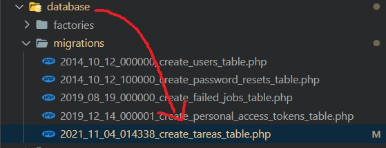


Lo abrimos y ponemos los campos de la tabla, dependiendo el tipo de datos que vayamos a guardar le asignamos, en este caso serán strings, el primer y el último campo son agregados automáticamente por laravel.


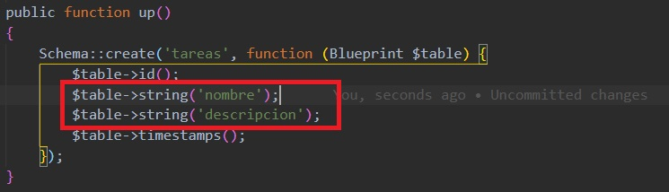


Ya que tengamos los campos de las tablas ya listos migramos.


```
migrando las tablas
-> php artisan migrate
```


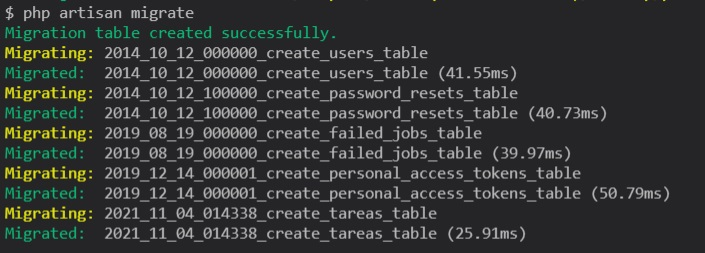


Las migraciones nos crean todo en la base de datos y las formas de migrar son importantes, para ver otras opciones de migración click al link ↓


[:pager: Estructura de migraciones](https://laravel.com/docs/8.x/migrations)


En la clase del modelo que se creó pondremos lo siguiente.


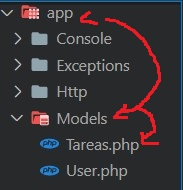


Debemos ver que estén importadas las clases y luego ponemos el resto.


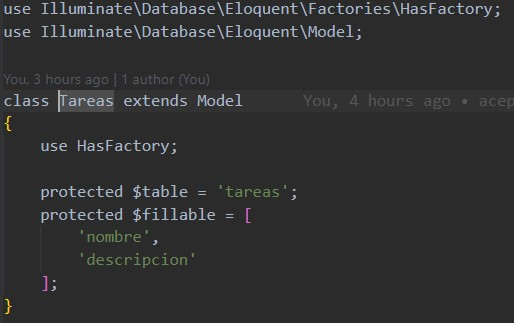


### 5.  REQUESTS


Ahora, luego de tener la base de datos lista, vamos a hacer los Request, son ciertas reglas que deben ser cumplidos para ingresar o actualizar un campo en las tablas, por ejemplo: que un campo se requerido, que sea único etc. Para crear los request usamos el siguiente comando.


```
creando Request
-> php artisan make:request NOMBRE_REQUEST (Ejemplo GuardarTareasRequest)
```


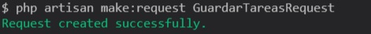


Luego que esté creado, vamos a darle las reglas, en este caso solo le diremos que los campos son requeridos. En authorize(), el return lo ponemos en TRUE, y en function rules ponemos los campos de la tabla, un Request por cada tabla. 


Sólo  serán para agregar y para editar.


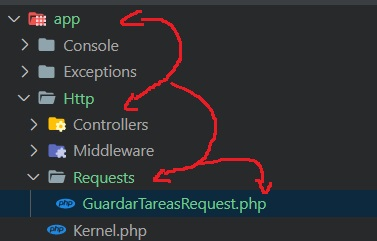


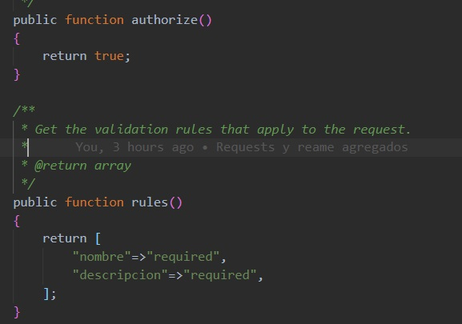


Como ya tenemos los Request, vamos a hacer las funciones en el Controller que hemos creado de la tabla.


### 6.  CONTROLLERS


Como ya tenemos los controllers creados, lo hicimos en ( ↑ 4.  MODELOS & MIGRATION ), primero haremos la función para mostrar los datos.


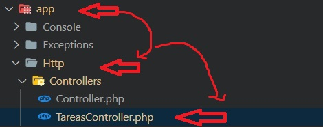


Abrimos el controlador, nos fijamos que estén importadas las siguientes clases, los requests y el modelo.


--------------------------------


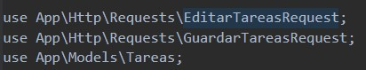


#### Ahora, las funciones.


--------------------------------


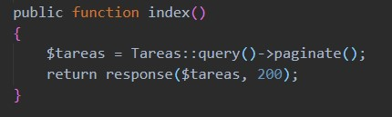


--------------------------------


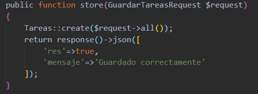


--------------------------------


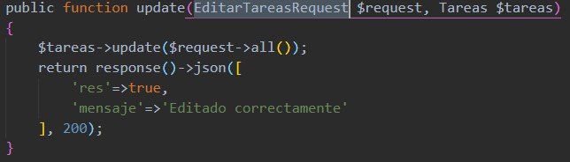


--------------------------------


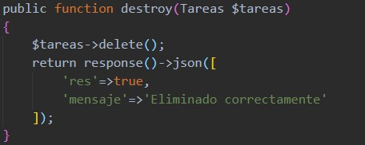


Todas las funciones del CRUD, index es para mostrar los datos, se puede hacer en la función show también, la de store es para registrar, update para editar y destroy para eliminar; en todas se hace instancia del modelo.
